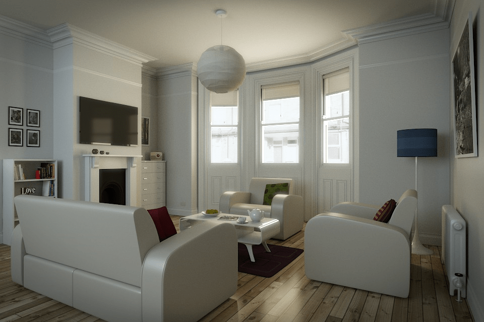

# Living Room

First used for rendering research and converted from Blender to Mitsuba/Tungsten/PBRT format by [Benedikt Bitterli](https://benedikt-bitterli.me/resources/).

Converted to OBJ by Nicholas Hull at NVIDIA, with materials corrected by Morgan McGuire at Williams College to match Bitterli's reference images. Originally called "The White Room Cycles" when authored on [Blend Swap](https://blendswap.com/blend/5014).  

  
